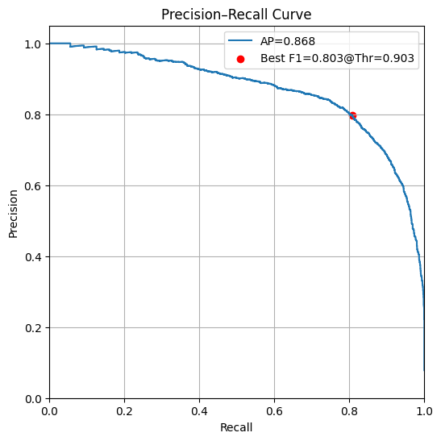
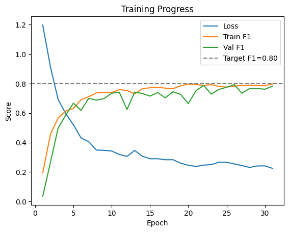
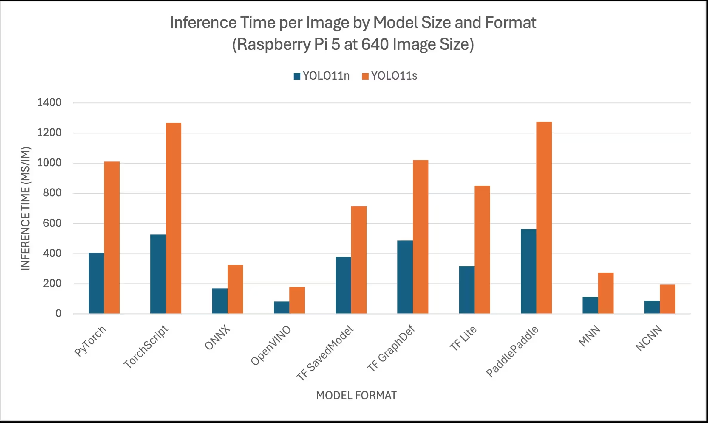
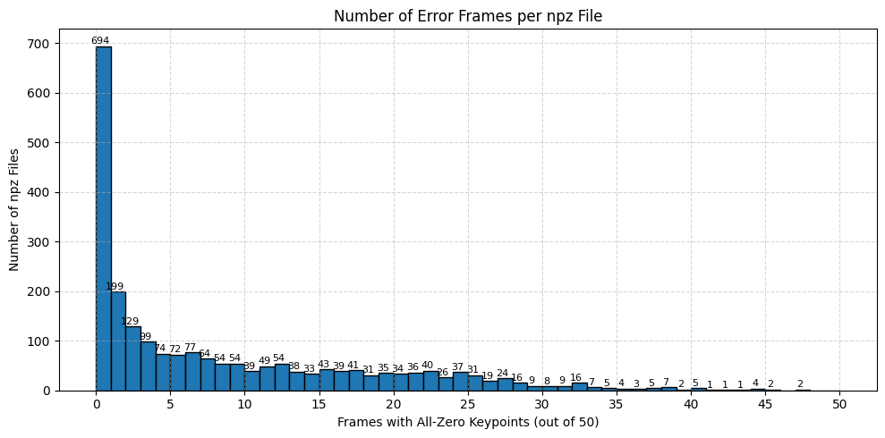

---

## 📈 성능 시각화 결과

### 1. Precision-Recall Curve

- **AP (Average Precision):** 0.868  
- **Best F1 Score:** 0.803 at threshold 0.903  
- 해당 곡선은 낙상 감지 모델의 정밀도(Precision)와 재현율(Recall)의 균형을 보여줍니다.  
- 점선으로 표시된 지점은 F1-score가 가장 높은 threshold로, 실제 시스템에서 활용 가능한 판단 기준 설정에 유용합니다.

---

### 2. 📉 Training Progress

- 학습 과정에서의 **Loss 감소**, **Train F1**, **Validation F1** 스코어 변화 추이를 시각화한 그래프입니다.  
- 약 10 epoch 이후 F1 성능이 0.8 근처에 수렴하면서 학습 안정화가 이뤄졌음을 확인할 수 있습니다.  
- 수평 점선은 목표 성능(Val F1 = 0.80)으로, 대부분의 구간에서 이를 초과 달성하였습니다.

---

### 3. ⚡ Inference Time by Model Format

- 다양한 모델 포맷(PyTorch, ONNX, OpenVINO 등)에 따라 **YOLOv11n, YOLOv11s 모델의 추론 시간(ms/image)**을 비교한 그래프입니다.  
- **OpenVINO 포맷**이 Raspberry Pi 5 기준으로 가장 빠른 추론 성능을 보여주며, 실시간 동작을 위해 본 프로젝트에서도 채택되었습니다.  
- YOLOv11n은 전체적으로 더 가볍고 빠르며, 경량화 모델로 적합합니다.

---

### 4. 📊 Dataset Error Frame Histogram

- 전체 npz 파일(시계열 포즈 데이터) 중 프레임 내 keypoint가 모두 0인 오류 프레임의 수를 나타낸 히스토그램입니다.  
- 대부분의 npz 파일은 오류 프레임이 적으나, 소수의 파일에서 오류가 집중되는 경향이 있습니다.  
- 데이터 품질을 개선하기 위한 사전 필터링 기준 수립에 활용되었습니다.
